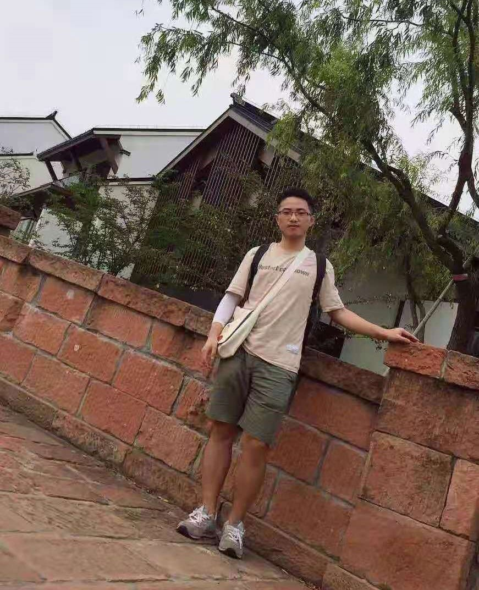

Peng-Tao Jiang (姜鹏涛)

I am a second-year PhD student at NKU, advised by Prof. Ming-Ming Cheng. I received my bachelor degree from Xidian University. My research interests include weakly-supervised learning, semantic segmentation.

## News

+ One paper was accepted by ICCV2019

## Education

+ 2017-    : Ph.D. student at Nankai University
+ 2013-2017: Ph.D. student 

## Publications

>  ***Integral Object Mining via Online Attention Accumulation***       
  **Peng-Tao Jiang**, Qibin Hou, Yang Cao, Ming-Ming Cheng, Yunchao Wei, Hong-Kai Xiong    
  IEEE International Conference on Computer Vision (ICCV), 2019   
  [PDF] [Project page] [Code]   
